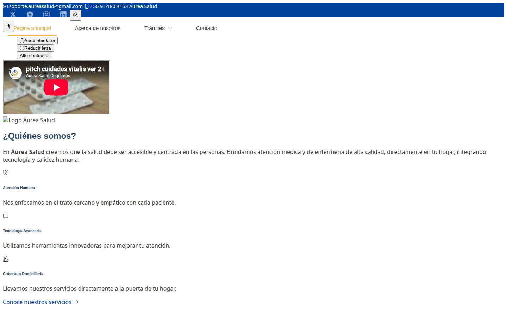
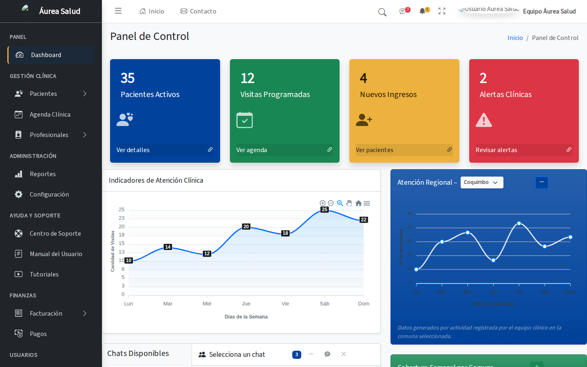

# Aurea Salud

Prototipo de plataforma web de salud/telemedicina para Coquimbo (Chile),
desarrollado entre 2024 y 2025 bajo el nombre inicial «Cuidados Vitalis».

> **⚠️ Proyecto incompleto / experimental — antiguo / de formación.**
> Nunca llegó a producción: no existe backend funcional ni persistencia de datos.
> Se publica como referencia histórica del proceso de aprendizaje.

## Alcance real (sin exagerar)

1. **Landing pública** (`Paginas/index.html`) — sitio informativo construido sobre
   plantilla [BootstrapMade](https://bootstrapmade.com) personalizada
   (crédito de la plantilla conservado en el pie de página).
2. **Login simulado** (`Paginas/login.html` + `JAVASCRIPT/login.js`) — validación de
   formato RUT y verificación por WhatsApp/Gmail/SMS **simulada en frontend**;
   no hay autenticación real.
3. **Panel administrativo** (`sistema/`) — maquetas estáticas sobre
   [AdminLTE v4](https://github.com/ColorlibHQ/AdminLTE) (MIT): pacientes, turnos,
   reportes, gestión de usuarios, permisos, configuración, agenda y gráficos
   Chart.js de ejemplo.

## Lo que NO existe

- Backend / API · base de datos (carpetas `SQL/` y `PYTHON/` quedaron vacías)
- Autenticación o verificación real de identidad
- Varias subpáginas quedaron como archivos vacíos (0 bytes)

## Capturas

### Landing pública



### Panel administrativo (maqueta AdminLTE)



## Estructura

```
├── Paginas/                  ← landing + login (+ subpáginas, varias sin contenido)
├── CSS/  ·  JAVASCRIPT/      ← estilos y scripts propios del sitio público
├── php/                      ← formularios de contacto/cita (mail() básico)
├── sistema/                  ← panel AdminLTE v4 + páginas propias estáticas
└── recursos-programacion/    ← assets vendor (Bootstrap, FontAwesome, Swiper…)
```

## Nota de licencia

El landing utiliza una plantilla de BootstrapMade cuya licencia gratuita requiere
conservar la atribución (se mantiene en el footer). El panel usa AdminLTE (MIT).

## Autor

**Patricio Varela C.** (CA2OPX) · [ORCID 0009-0002-1087-9445](https://orcid.org/0009-0002-1087-9445) · [github.com/2674321](https://github.com/2674321)

## Cita

Si utilizas este trabajo, por favor cítelo — ver [CITATION.cff](CITATION.cff).
